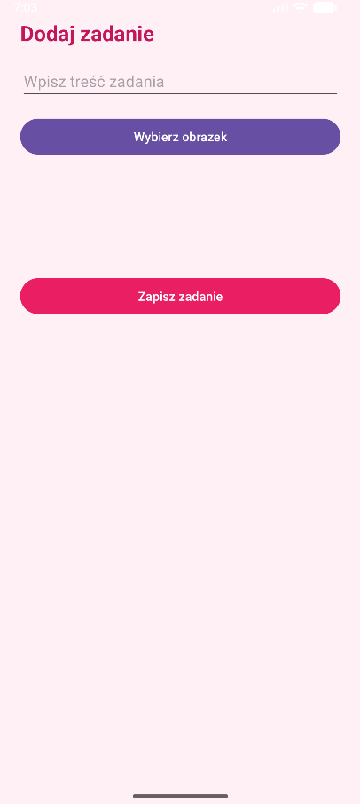
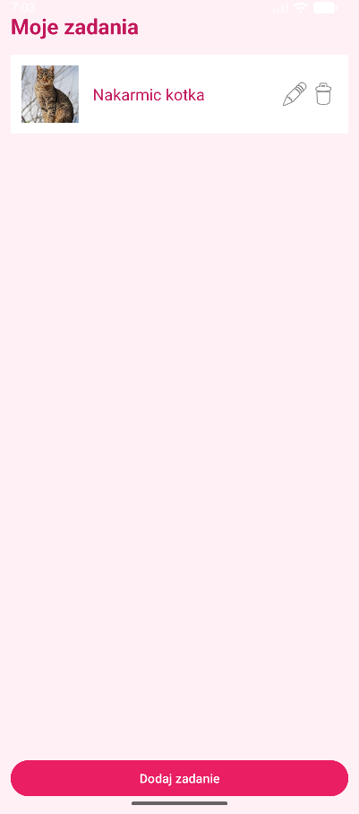

# ToDoApp - Projekt na Programowanie Aplikacji Mobilnych

## 1. Opis aplikacji

**Cel:** Aplikacja ToDoApp to mobilna lista zadań, która pozwala użytkownikom na łatwe zarządzanie codziennymi obowiązkami. 

**Grupa docelowa:** Osoby, które potrzebują prostego narzędzia do organizacji swojego czasu i śledzenia postępów w realizacji zadań.

**Główne funkcjonalności:**
- Dodawanie nowych zadań z opcjonalnym obrazkiem.
- Edytowanie istniejących zadań i ich obrazków.
- Usuwanie zadań z listy.
- Przechowywanie zadań w pamięci urządzenia, aby nie znikały po zamknięciu aplikacji.

## 2. Wybrana technologia

Projekt został zrealizowany w technologii **Android Natywny** przy użyciu języka **Kotlin** i środowiska **Android Studio**. 

**Uzasadnienie:** Wybór natywnej technologii Androida zapewnia najlepszą wydajność, stabilność i dostęp do najnowszych funkcji systemu operacyjnego. Kotlin jest nowoczesnym, zwięzłym i bezpiecznym językiem programowania, oficjalnie wspieranym przez Google do tworzenia aplikacji na Androida.

## 3. Architektura aplikacji

Aplikacja opiera się na prostej architekturze zorientowanej na interfejs użytkownika. Składa się z następujących komponentów:

- **Activities:** (`MainActivity`, `AddTastActivity`, `EditTaskActivity`) - Każda aktywność odpowiada za jeden ekran w aplikacji i zarządza logiką interfejsu użytkownika.
- **RecyclerView i Adapter:** (`TaskAdapter`) - Służą do wydajnego wyświetlania listy zadań.
- **Data Class:** (`Task`) - Model danych reprezentujący pojedyncze zadanie (tekst + identyfikator obrazka).
- **Storage:** (`TaskStorage` z `SharedPreferences` i `Gson`) - Klasa odpowiedzialna za trwałe zapisywanie i odczytywanie listy zadań z pamięci urządzenia.

## 4. Opis zaimplementowanych funkcjonalności

Aplikacja spełnia 5 kluczowych wymagań funkcjonalnych:

1.  **Wiele ekranów/widoków:** Aplikacja posiada 3 ekrany: główny z listą zadań, ekran dodawania zadania oraz ekran edycji zadania.
2.  **Interakcja z użytkownikiem:** Użytkownik może dodawać, edytować i usuwać zadania za pomocą przycisków i formularzy.
3.  **Przechowywanie danych:** Lista zadań jest zapisywana lokalnie za pomocą `SharedPreferences`, co zapewnia trwałość danych.
4.  **Lista/siatka elementów:** Zadania są wyświetlane na przewijanej liście `RecyclerView`.
5.  **Multimedia:** Użytkownik może dołączyć do każdego zadania obrazek z galerii w telefonie.

## 5. Zrzuty ekranu

## 6. Instrukcja uruchomienia

1.  Sklonuj repozytorium projektu.
2.  Otwórz projekt w najnowszej wersji Android Studio.
3.  Poczekaj, aż Gradle zsynchronizuje wszystkie zależności.
4.  Uruchom aplikację na emulatorze Androida lub na fizycznym urządzeniu.

## 7. Napotkane problemy

Podczas implementacji projektu napotkano kilka problemów, takich jak:
- **Początkowe błędy budowania:** Spowodowane były pomyleniem zawartości plików `MainActivity.kt` i `TaskAdapter.kt` oraz ich niewłaściwą lokalizacją w strukturze projektu. Zostało to rozwiązane przez przywrócenie poprawnej zawartości i usunięcie zduplikowanego pliku.
- **Błąd zależności Gradle:** Wystąpił błąd przy dodawaniu biblioteki `Gson` z powodu nieprawidłowej składni w pliku `build.gradle.kts`. Poprawiono go, używając składni `implementation("...")`.

## 8. Możliwości rozwoju

- **Powiadomienia:** Dodanie lokalnych powiadomień przypominających o terminie wykonania zadania.
- **Autoryzacja użytkownika:** Implementacja logowania i rejestracji, aby umożliwić synchronizację zadań między urządzeniami.
- **Komunikacja sieciowa:** Pobieranie lub synchronizowanie zadań z zewnętrznym API.
- **Sortowanie i filtrowanie:** Dodanie opcji sortowania zadań (np. po dacie) lub filtrowania (np. tylko ukończone).
